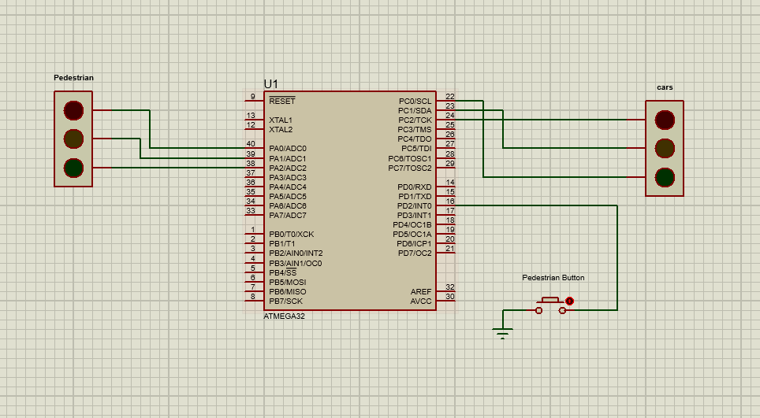

# On Demand Traffic Light Control
Coded on Microchip Studio with AVR compiler. 

## Project Describtion 
• Traffic light system that organizes the traffic for cars 
and pedestrians.

• It’s supplied with a crosswalk button to let the signal 
operations know that someone is planning to cross 
the street, so the light adjusts, giving pedestrians 
enough time to get across.

## System Design
### Hardware requirements:
1. ATmega32 microcontroller
2. One push button connected to INT0 pin for pedestrian
3. Three LEDs for pedestrians - Green, Yellow, and Red, connected on port A, pins 0, 1, and 2
4. Three LEDs for cars - Green, Yellow, and Red, connected on port C, pins 0, 1, and 2

## How to Run
you can install the code on the physical MCU or Proteus as simulation if you have the license.

Her is the connections:

